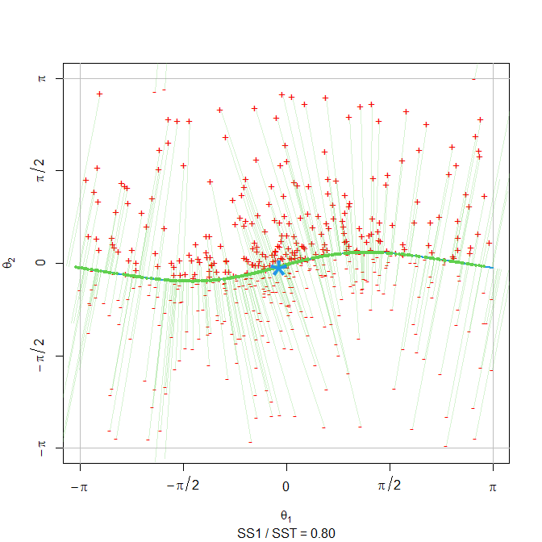

# ridgetorus

[](https://www.gnu.org/licenses/gpl-3.0)
[](https://github.com/apt345/ridgetorus/actions)
[](https://github.com/apt345/ridgetorus/actions)
[](https://codecov.io/gh/apt345/ridgetorus)
[](https://cran.r-project.org/package=ridgetorus)
[](https://cran.r-project.org/package=ridgetorus)
[](https://cran.r-project.org/package=ridgetorus)

<!--  -->

## Overview

Implementation of principal component analysis on the two-dimensional
torus 𝕋<sup>2</sup> = \[ − *π*, *π*)<sup>2</sup> via density ridges.
Software companion for the paper “*Toroidal PCA via density ridges*”
(García-Portugués and Prieto-Tirado, 2021).

## Installation

Get the latest version from GitHub:

``` r
# Install the package
library(devtools)
install_github("apt345/ridgetorus")

# Load package
library(ridgetorus)
```

## Usage

The main functionality of `ridgetorus` is the function `ridge_pca()`,
which can be employed to do dimension reduction via the bivariate sine
von Mises (Singh et al., 2002) and the bivariate wrapped Cauchy (Kato
and Pewsey, 2015) models, as the following examples show.

### Bivariate sine von Mises

``` r
# 1. Simulate data from r_bvm()
n <- 1000
data <- r_bvm(mu1 = 0, mu2 = 0, k1 = 1.3, k2 = 1.9, lambda = 1.55, n = n)

# 2. Do ridge_pca()
fit <- ridge_pca(x = data, type = "bvm")

# 3. Plot simulated data with ridge fit using show_ridge_pca()
show_ridge_pca(fit, col_data = "red")
```


``` r
# 4. Plot pairs plots of original data and scores with torus_pairs()
torus_pairs(data, col_data = "red", bwd = "EMI")
```


``` r
torus_pairs(fit$scores, col_data = "red", bwd = "EMI", scales = fit$scales)
```


### Bivariate wrapped Cauchy

``` r
# 1. Simulate data from r_bwc()
data <- r_bwc(mu1 = 0, mu2 = 0, xi1 = 0.3, xi2 = 0.6, rho = 0.25, n = 1000)

# 2. Do ridge_pca()
fit <- ridge_pca(x = data, type = "bwc")

# 3. Plot simulated data with ridge fit using show_ridge_pca()
show_ridge_pca(fit, col_data = "red")
```



``` r
# 4. Plot pairs plots of original data and scores with torus_pairs()
torus_pairs(fit$scores, col_data = "red", bwd = "EMI", scales = fit$scales)
```


## Data application in oceanography

The data applications in García-Portugués and Prieto-Tirado (2021) can
be reproduced through the script
[data-application.R](https://github.com/egarpor/apt345/blob/master/application/data-application.R).
The code snippet below illustrates the toroidal PCA analysis onto
currents of two zones at Santa Barbara strait. Zone B, the interisland
channel, and zone C, the eastern extreme of Santa Barbara.

``` r
# Load data
data("santabarbara")

# Example with zone B-C
fitbvm <- ridge_pca(x = santabarbara[c("C", "B")], type = "bvm", N = 1e3)
fitbwc <- ridge_pca(x = santabarbara[c("C", "B")], type = "bwc", N = 1e3)

#Compare wchich fit is better, bvm or bwc by comparing BIC
if (fitbvm$BIC_fit < fitbwc$BIC_fit) {
  show_ridge_pca(fit = fitbvm, col_data = "black", n_max = 1e3)
  
  torus_pairs(santabarbara[c("C", "B")], col_data = "black")
  
  torus_pairs(fitbvm$scores, col_data = "black", scales = fitbvm$scales)
} else {
  show_ridge_pca(fit = fitbvm, col_data = "black", n_max = 1e3)
  
  torus_pairs(santabarbara[c("C", "B")], col_data = "black")
  
  torus_pairs(fitbvm$scores, col_data = "black", scales = fitbvm$scales)
  
}
```


It can be seen how the bivariate von Mises is the most adecuate fit. The
toroidal PCA explains 77% of the total variance which motivates its use
for dimension reduction. The scores also transform the data
distribution, reducing noise and allowing to check for groups or
outliers, if any.

## References

García-Portugués, E. and Prieto-Tirado, A. (2021). Toroidal PCA via
density ridges. *arXiv:2109.XXXXX*. <https://arxiv.org/abs/2109.XXXXX>.

Kato, S. and Pewsey, A. (2015). A Möbius transformation-induced
distribution on the torus. *Biometrika*, 102(2):359–370.
[doi:10.1093/biomet/asv003](https://doi.org/10.1093/biomet/asv003).

Singh, H., Hnizdo, V., and Demchuk, E. (2002). Probabilistic model for
two dependent circular variables. *Biometrika*, 89(3):719–723.
[doi:10.1093/biomet/89.3.719](https://doi.org/10.1093/biomet/89.3.719).
